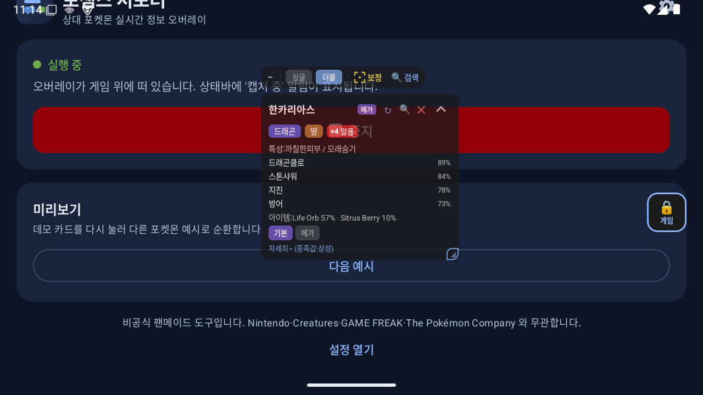
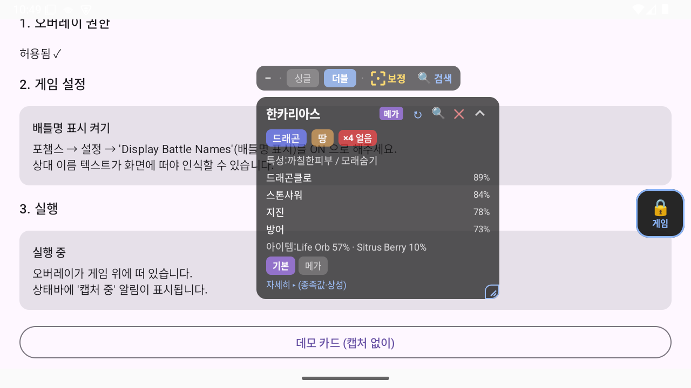
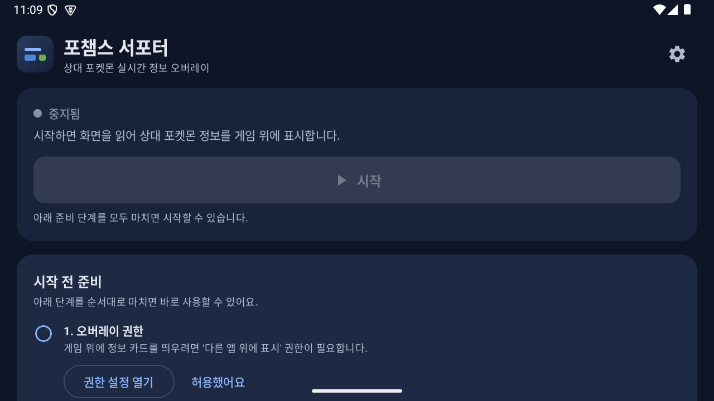

# 포챔스 서포터 (PokeChamps Supporter)

**포켓몬 챔피언스(포챔스) 대전 중, 화면에 뜬 상대 포켓몬 이름을 읽어 타입·특성·주요 기술·방어 상성·아이템/스피드/예상 팀원을 게임 위에 실시간 오버레이로 표시하는 안드로이드 앱.**

- 🔒 **데이터 수집 0 · 전송 0** — 모든 처리(화면 OCR·매칭·조회)는 기기 안에서만. 계정도, 로그인도, 광고도 없습니다.
- 📴 **오프라인 동작** — 포켓몬 데이터는 앱에 내장. 인터넷은 "데이터 업데이트"를 직접 누를 때만 사용합니다.
- 🖼️ **화면에 공개된 정보만** 사용 — 게임 메모리를 읽거나 입력을 자동화하지 않습니다.

<p align="center">
  
</p>
<p align="center">
  
  &nbsp;
  
</p>

---

## 📥 설치

> ⚠️ **비공식 배포**입니다. Google Play 가 아닌 GitHub Releases 에서 APK 를 직접 내려받아 설치(사이드로드)합니다.

### 1) APK 로 설치 (가장 간단)

1. **[Releases](https://github.com/kohana-dev/pochamps-supporter/releases/latest)** 에서 최신 `.apk` 파일을 폰으로 내려받습니다.
2. 내려받은 APK 를 탭하면 안드로이드가 설치를 시작합니다.
   - 처음이면 "이 출처의 앱 설치 허용" 을 켜라는 안내가 뜹니다(Android 8+). 해당 앱(브라우저/파일앱)에 대해 허용해 주세요.
3. **Play Protect 경고 안내**: 인터넷에서 받은 앱이라 "Google Play Protect 가 확인하지 못한 앱" 경고가 뜰 수 있습니다.
   - 이 앱은 문자/접근성/알림 접근 같은 민감 권한을 **쓰지 않으므로** 하드 블록 대상이 아니며, **"자세히 → 무시하고 설치(Install anyway)"** 로 설치할 수 있습니다.
   - 앱이 요청하는 권한은 오버레이·화면 캡처(매번 동의)·알림·인터넷(선택)뿐입니다. → [개인정보처리방침](https://kohana-dev.github.io/pochamps-supporter/docs/privacy-policy.html)

### 2) Obtainium 으로 설치 (자동 업데이트 원하는 파워유저)

[Obtainium](https://github.com/ImranR98/Obtainium) 은 GitHub Releases 를 주기적으로 확인해 새 버전을 알려주는 오픈소스 앱입니다. 아래 배지를 Obtainium 이 설치된 폰에서 탭하면 이 앱이 원탭으로 등록됩니다.

[](https://apps.obtainium.imranr.dev/redirect?r=obtainium://add/https://github.com/kohana-dev/pochamps-supporter)

> 딥링크: `obtainium://add/https://github.com/kohana-dev/pochamps-supporter`
> (Obtainium 자체도 사이드로드가 필요합니다. 일반 유저는 위 1) APK 직접 설치를 권장합니다.)

---

## ▶️ 사용법 (요약)

1. 앱을 열고 홈 화면의 **준비 단계**를 순서대로 마칩니다.
   - ① **오버레이 권한**("다른 앱 위에 표시") 허용
   - ② **알림 권한** 허용(Android 13+)
   - ③ 게임에서 **배틀명 표시(Display Battle Names)** 켜기 — 상대 이름이 화면에 떠야 인식됩니다.
2. **[시작]** → 화면 캡처 동의 → 게임을 켜면 상대 포켓몬 정보 카드가 게임 위에 뜹니다.
3. 카드는 드래그로 이동, 모서리로 크기 조절, 탭으로 접기/펼치기. 게임 조작이 필요하면 핸들로 터치 통과 모드로 전환합니다.
4. 처음 위치가 안 맞으면 오버레이의 **보정(⃞)** 으로 이름 인식 영역을 화면에 맞춥니다.

> **캐주얼·연습 용도로만** 사용하세요. 공식 랭크전·Play! Pokémon(VGC) 등 공인 대회에서는 보조 도구 사용이 제한·실격 사유가 될 수 있습니다(앱 내 고지 참고). 계정 제재 위험은 사용자 본인 책임입니다.

---

## ⚖️ 비공식 고지

본 앱은 팬이 만든 **비공식 도구**이며, Nintendo, Creatures Inc., GAME FREAK inc., The Pokémon Company 및 그 계열사와 어떠한 제휴·후원·보증 관계도 없습니다. "Pokémon"·"포켓몬" 등 모든 관련 상표와 저작권은 각 소유자에게 있으며, 상표는 설명 목적의 지시적 사용에 한합니다. 공식 아트워크·스프라이트·로고를 일절 사용하지 않으며, 타입·특성·사용률 등 **사실 데이터**만 표시합니다.

- 📄 **개인정보처리방침**: [한국어](https://kohana-dev.github.io/pochamps-supporter/docs/privacy-policy.html) · [English](https://kohana-dev.github.io/pochamps-supporter/docs/privacy-policy-en.html)
- 🐛 **문의·버그 신고**: [GitHub Issues](https://github.com/kohana-dev/pochamps-supporter/issues)
- 📱 **플랫폼**: 안드로이드 전용(오버레이+화면캡처는 안드로이드에서만 가능. iOS 불가). 최소 Android 8(API 26).

---
---

# 개발자 문서

> 아래는 이 저장소를 빌드·수정하려는 개발자를 위한 내용입니다. 일반 사용자는 위 "설치" 까지만 보면 됩니다.

**패키지**: `com.pochamps.supporter` · **현재 버전**: v0.2.0 (versionCode 21)

문서: [DESIGN.md](DESIGN.md)(실현성/설계) · [PROGRESS.md](PROGRESS.md)(진행 이력 P1~P34) · [FIELD_TEST.md](FIELD_TEST.md)(실기기 검증 절차) · [PRODUCTION_PLAN.md](PRODUCTION_PLAN.md)(출시 계획) · [research/](research/)(경쟁·IP·배포·크래시·Play 조사)

## 아키텍처 요약 (컴포넌트 [1]~[7])

DESIGN.md 3장의 데이터 플로우. 포그라운드 서비스 안에서 한 사이클이 돈다:

```
[1] CaptureManager   MediaProjection → VirtualDisplay → ImageReader (다운스케일 프레임)
        │
[2] FrameGate        ROI 변화 감지(다운샘플 해시 diff) — 바뀔 때만 다음 단계 (발열/전력 절감)
        │
[3] RoiCropper       비율(0~1) ROI 크롭 + 2x 업스케일 (실패 시 상단 절반 fallback)
        │
[4] OcrEngine        ML Kit Text Recognition v2 (다국어 병렬 recognizer) → 이름 라인
        │
[5] NameMatcher      정규화 + candidate_index 완전일치 → 실패 시 Levenshtein fuzzy → 후보
        │
[6] LocalRepository  내장 JSON 조회 → 타입/특성/사용률 기술·아이템·팀원/종족값/메가 링크
        │
[7] OverlayRenderer  WindowManager(TYPE_APPLICATION_OVERLAY) + Compose 카드 (터치 통과, 드래그)
```

- **소형 창 전략**: 오버레이 창을 카드 bounds(WRAP_CONTENT)로만 유지 → 창 밖은 자동으로 게임에 터치 통과.
- **파이프라인**: conflate 채널로 최신 프레임만 워커(Dispatchers.Default)에 전달(backpressure).
- **순수 JVM 분리**: FrameGate/RoiConfig/NameMatcher/PipelineDecider/TypeChart/SpeedCalc/OverlayCardData/CrashLog 등 Android 비의존 로직은 별도 클래스로 빼 Robolectric 없이 유닛 테스트(294 테스트).
- **로컬 크래시 리포트(P34)**: `SupporterApp`(Application)이 `CrashReporter.install` 로 전역 UncaughtExceptionHandler 설치 → 스택트레이스+버전+기기모델을 `filesDir/crash/` 에 저장(최근 5개). 자동 전송 없음 — 설정 [고급] "버그 리포트 공유"(ACTION_SEND)로 유저가 고를 때만 나감. 포맷·로테이션은 `crash/CrashLog.kt`(순수 로직) + `CrashLogTest`.

### 소스 위치
```
android/app/src/main/java/com/pochamps/supporter/
  SupporterApp.kt          Application — 크래시 핸들러 설치(P34)
  capture/   [1] CaptureManager · CaptureService(FGS) · [2] FrameGate · [3] RoiConfig/RoiCropper ·
             RecognitionPipeline · PipelineDecider
  ocr/       [4] OcrEngine
  matching/  [5] NameMatcher · MatchResult
  data/      [6] PokedexRepository · AssetsPokedexLoader · Pokedex/Usage/CandidateIndex/Localized ·
             TypeChart · SpeedCalc · AppSettings · DbFiles/DbManifest/DbUpdateManager(P13)
  overlay/   [7] OverlayRenderer · OverlayCard · OverlayCardData · OverlayPosition
  crash/     CrashLog(순수 로직) · CrashReporter(Android glue) — P34
  ui/        MainActivity(홈/설정/라이선스) · Licenses(정적 목록) · OnboardingState
```

## 데이터 파이프라인 (`data/`)

앱에 내장되는 JSON 3종을 만드는 스크립트(스냅샷 방식 — 메타가 자주 안 바뀌므로 1회 수집).
소스: **op.gg**(포켓덱스 + 9언어 사전) + **championsbattledata**(실사용률).

| 산출물 | 내용 | 규모 |
|---|---|---|
| `pokedex_db.json` | 317종 × 9언어 이름/타입/특성/종족값/movepool + 타입·특성·기술 다국어 사전 + base↔메가 링크 | ~990KB |
| `usage_db.json` | 234종 × {싱글,더블} 실사용률(기술/아이템/특성/성격/EV/파트너) | ~1.8MB |
| `candidate_index.json` | 표시명 충돌 그룹(species root) + 언어별 `정규화이름→root` 조회 | ~170KB |

이 3종은 `android/app/src/main/assets/` 에 복사되어 APK 에 동봉된다.

### 재실행법 (메타 갱신 시)
반드시 **순서대로** 실행한다(뒤 스크립트가 앞 산출물을 조인):
```bash
cd data
python3 scrape_pokedex.py          # → pokedex_db.json  (op.gg 뼈대 + 9언어 사전)
python3 merge_usage.py             # → usage_db.json     (championsbattledata 사용률, pokedex 와 조인)
python3 build_candidate_index.py   # → candidate_index.json (표시명 충돌 그룹 + lookup)

# 갱신본을 앱 assets 로 복사
cp pokedex_db.json usage_db.json candidate_index.json ../android/app/src/main/assets/
```

## 원격 데이터 갱신 (앱 재설치 없이 데이터만 교체) — P13

레귤레이션/메타가 바뀌면 앱을 재빌드·재설치하지 않고 **데이터만** 갱신할 수 있다(DESIGN.md 4-6). 서버 연산 없음 — **정적 파일 호스팅 + manifest 버전 체크**로 서버비 0원.

- `data/build_release.py` 가 JSON 3종을 **gzip 압축** + `manifest.json`(dataVersion, 파일별 sha256/size)으로 패키징 → `data/dist/`.
- 이 `dist/` 폴더를 **GitHub Pages** 등 정적 호스팅에 올린다(현재: <https://kohana-dev.github.io/pochamps-supporter/data/dist/>).
- 앱 설정의 **"데이터 업데이트"** 버튼(수동): manifest 조회 → `dataVersion` 비교 → 신규면 3종 다운로드(gzip 해제) + **sha256 검증** → `filesDir/db/` 에 **원자적 교체**. 실패 시 조용히 기존본 유지(오프라인·실패 안전).

### 운영 절차 (데이터 갱신 배포)
```bash
cd data
python3 build_release.py                 # dataVersion = 오늘 날짜스탬프(YYYYMMDD)
git add data/dist && git commit -m "data: release YYYYMMDD"
# Pages 자동 반영 → 앱에서 설정 → "데이터 업데이트" 버튼
```

### base URL 설정 (빌드 시)
`app/build.gradle.kts` 의 `DATA_UPDATE_BASE_URL`(기본값 = 위 Pages URL). CLI 오버라이드:
`./gradlew :app:assembleRelease -PdataUpdateBaseUrl=https://.../data/dist/`

### GitHub Pages 설정
GitHub → **Settings → Pages** → Source `Deploy from a branch`, 브랜치 `main` / 폴더 `/ (root)`.
- 데이터: `https://<user>.github.io/<repo>/data/dist/manifest.json`
- 개인정보처리방침(HTML): `https://<user>.github.io/<repo>/docs/privacy-policy.html`
  > 저장소에 Jekyll(`_config.yml`)을 두지 않으므로 `.md` 는 원문 텍스트로 서빙된다. 렌더링을 보장하려면 `.html` 을 사용한다(앱은 `.html` URL 로 링크).

## 빌드

요구: Android SDK(platform 35, build-tools), JDK 17+. `android/local.properties` 에 `sdk.dir` 설정.

```bash
cd android

# 유닛 테스트(순수 JVM — 294 테스트)
./gradlew :app:testDebugUnitTest

# 디버그 APK (bundled ML Kit ~55MB)
./gradlew :app:assembleDebug        # → app/build/outputs/apk/debug/app-debug.apk

# 릴리스 APK (R8 minify + arm64 단일 ABI, ~16.8MB, 디버그 키 서명)
./gradlew :app:assembleRelease      # → app/build/outputs/apk/release/app-release.apk
```

- **릴리스 minify**: R8 on. keep 규칙은 `android/app/proguard-rules.pro`(kotlinx-serialization + ML Kit).
- **서명**: 현재는 사이드로드 편의를 위해 디버그 키로 서명. Play 업로드 시 정식 upload key 로 교체.

## 권한 (AndroidManifest)
- `SYSTEM_ALERT_WINDOW` — 게임 위 오버레이.
- `FOREGROUND_SERVICE` + `FOREGROUND_SERVICE_MEDIA_PROJECTION`(+`SPECIAL_USE` 데모) — 화면 캡처 FGS(Android 14+ 필수 조합).
- `POST_NOTIFICATIONS` — 캡처 중 상태바 알림(Android 13+).
- `INTERNET` — 원격 데이터 갱신(수동 버튼)의 manifest/gz 다운로드용. base URL 미설정 시 네트워크 호출 없음.

메모리 훅/자동입력 없음 — **화면에 공개된 정보만 표시**한다.

## 언어 — 두 개념 분리 (P19)

| 개념 | 설정 항목 | 저장키 | 무엇을 좌우하나 |
|---|---|---|---|
| **인식**(캡처/OCR) | (P31부터 항상 다국어 병렬 인식 — 캡처 언어 설정 폐지) | — | 어떤 언어로 떠도 4개 스크립트를 병렬로 읽어 도감키 확정 |
| **앱 표시 언어**(UI + 카드) | "앱 표시 언어" | `AppSettings.displayLang` | 앱 UI 문자열 + 카드 내용(이름·타입·특성·기술). 유저가 보고 싶은 언어 |

- **앱 UI 9개 언어**: `values`(ko 기본)·`-en`·`-ja`·`-de`·`-es`·`-fr`·`-it`·`-zh-rCN`·`-zh-rTW`. ko/ja/en 정확, 유럽어·중국어는 best-effort(누락 키는 기본 ko 로 폴백).

## 문서
- [DESIGN.md](DESIGN.md) — 실현성 검토, 선검증 K1~K4, 기술 스택, 아키텍처, UI/UX, 온보딩.
- [PROGRESS.md](PROGRESS.md) — 페이즈별 진행 이력(P1~P34)과 실기기 검증 체크리스트.
- [FIELD_TEST.md](FIELD_TEST.md) — 실기기 테스트 절차(K1 우선, ROI 보정, OCR 실측, 트러블슈팅).
- [PRODUCTION_PLAN.md](PRODUCTION_PLAN.md) · [research/](research/) — 출시 계획과 근거 조사(경쟁·Play·IP·배포·크래시).
